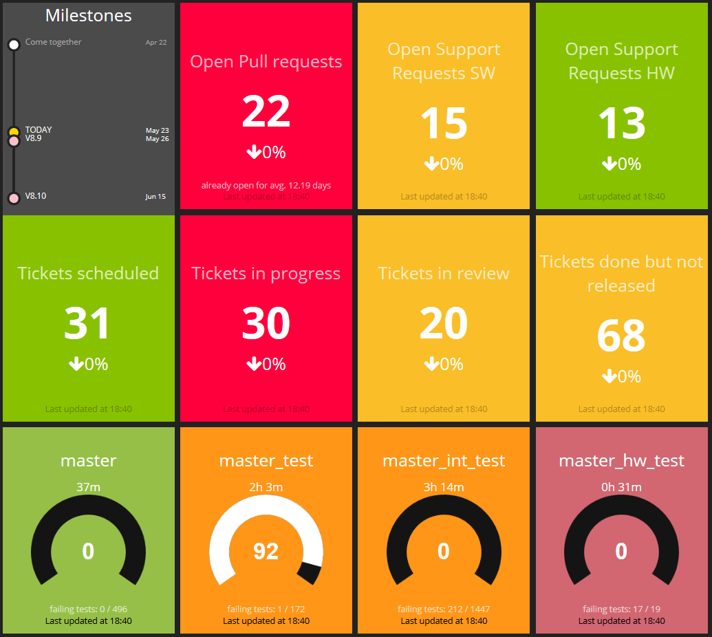
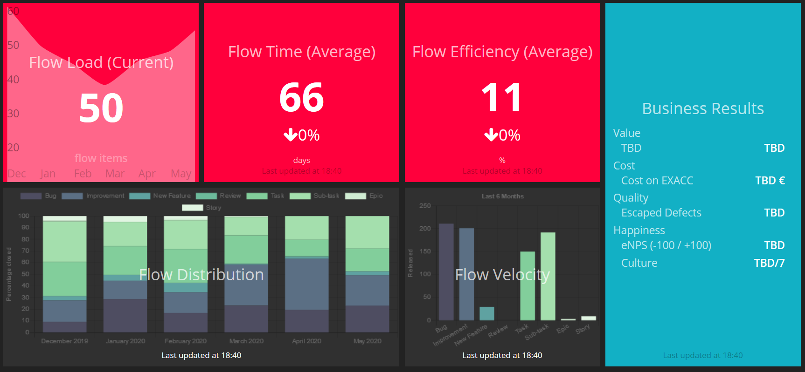

# Flowboard for Smashing
This is an example dashboard for visualizing flow using Smashing and data from Jira, GIT and Jenkins




Data has been changed to protect the innocent.

## More Information
Watch out for an upcoming blog post at: https://pickl.eu/blog/ on situational awareness and running the dashboard on a raspberry pi.

Upcoming presentations at: 
- https://www.jonthebeach.com/: [Are we really moving faster? How visualizing flow changed the way we work](https://www.jonthebeach.com/speakers/136/Roman+Pickl)

Best way to reach me is via the contact information listed on my website: https://pickl.eu/

If you find a problem or something to improve please create a Pull Request.

## References

Smashing Dashboard Software: https://smashing.github.io/

Smashing on GitHub: https://github.com/Smashing/smashing

Inspired by Mik Kersten's Project to Product book: https://projecttoproduct.org/

See the [license folder](licenses) for further links and attributions.

Thanks to the smashing community for the resources and widgets they have created.

# Files to check

To understand how this dashboard works have a look at the following files:

* [config.ru](config.ru): See routes_to_cycle_through which are used by [sinatra cyclist](https://github.com/vrish88/sinatra_cyclist) to cycle through the boards
* [config/jira.yaml](config/jira.yaml): Main entrypoint to setup jira credentials and filter / flow settings
* [config/issue_colors.yaml](config/issue_colors.yaml): Colour settings for issue types
* [config/settings.rb](config/settings.rb): Detects if dashboard is running in [visibilityspots/smashing docker container](https://hub.docker.com/r/visibilityspots/smashing) and if yes takes the config.ru file from the config folder instead of the root folder, also loads jira.yaml into a global var (need to find a better solution), which is used in jira related jobs
* [config/timeline_data.yaml](config/timeline_data.yaml): Static events to visualize in the timeline

* [dashboards/metrics.erb](dashboards/metrics.erb): Visualization of Flow metrics. Configure widgets there.
* [dashboards/status.erb](dashboards/status.erb): Visualization of Timeline, Jira filters / Jira status, Jenkins status. Configure widgets there.

* [jobs/business_results.rb](jobs/business_results.rb): Provides data on Value/Cost/Quality/Happiness
* [jobs/flow_distribution.rb](jobs/flow_distribution.rb): Provides data on Flow distribution
* [jobs/flow_load.rb](jobs/flow_load.rb): Provides data on Flow load
* [jobs/flow_metrics.rb](jobs/flow_metrics.rb): Provides data on Flow efficiency and Flow time
* [jobs/flow_velocity.rb](jobs/flow_velocity.rb): Provides data on Flow velocity
* [jobs/github_stats.rb](jobs/github_stats.rb): Provides data on Open pull requests. Configure host, credential and repo there
* [jobs/jenkins_build.rb](jobs/jenkins_build.rb): Provides data about jenkins jobs. Setup jobs and credentials there
* [jobs/jira_issuecount.rb](jobs/jira_issuecount.rb): Provides data for jql queries defined in jira.yaml
* [jobs/timeline.rb](jobs/timeline.rb): Provides data from config/timeline_data.yaml and jira releases

* [licenses](licenses): Licenses and links to sources

* [widgets](widgets): Mainly standard wigets and widgets from (https://github.com/Smashing/smashing/wiki/Additional-Widgets) are used which have been slightly adapted to show 'hotness' and to be clickable to lead to the source

# Quickstart using visibilityspots/smashing docker image
* Setup [config/jira.yaml](config/jira.yaml), [jobs/github_stats.rb](jobs/github_stats.rb), [config/issue_colors.yaml](config/issue_colors.yaml) and [jobs/jenkins_build.rb](jobs/jenkins_build.rb), set data-ids in [dashboards/status.erb](dashboards/status.erb) (e.g. yourOrg/yourRepo provided from github_stats.rb as well as master, master_test, master_int_test, master_hw_test from jobs/jenkins_build.rb, etc.)
* Copy your config.ru to the config folder
* ```docker run -e GEMS="octokit jira-ruby sinatra_cyclist" -v=C:\<path>\Smashing-Flowboard\config:/config -v=C:\<path>\Smashing-Flowboard\jobs:/jobs -v=C:\<path>\Smashing-Flowboard\widgets:/widgets -v=C:\<path>\Smashing-Flowboard\dashboards:/dashboards -v=C:\<path>\Smashing-Flowboard\assets:/assets -p 8080:3030 visibilityspots/smashing```
* Navigate to http://localhost:8080
* Use http://localhost:8080/_cycle?duration=60 to cycle through the dashboards every 60 seconds
